

  <a href="https://rowienski-interactive.pl">
    
  </a>

 

  
  
  

 


Nazywam się **Mateusz Rowieński** i prowadzę jednoosobowy warsztat, który właśnie
zamienia się w firmę. Nie pokazuję makiet ani szablonów - tylko rzeczy, które można
otworzyć i sprawdzić: system dla klinik działający online, grę w produkcji i programy
na Windowsa gotowe do pobrania.

Odpowiadam za wszystko: architekturę, kod, bazy danych, serwery i bezpieczeństwo, ale
też za to, jak produkt wygląda i jak się go używa. **Claude Code to narzędzie, nie
współautor** - przyspiesza pisanie kodu i zdejmuje ze mnie powtarzalną robotę, dzięki
czemu jeden człowiek ogarnia tyle projektów naraz. Struktura, decyzje projektowe
i odpowiedzialność za to, co trafia na produkcję, zostają po mojej stronie.

**AI nie tylko w chmurze.** MNICH tłumaczy pliki gier i modów lokalnie, na polskim
modelu **Bielik**, uruchomionym na karcie graficznej użytkownika - żaden tekst nie
wychodzi poza jego komputer. NBB usuwa tło z grafik tak samo: model liczy u odbiorcy,
bez konta i bez wysyłania zdjęć na cudzy serwer. Potrafię postawić model lokalnie
i wpiąć go w program tak, żeby wykonywał konkretną robotę, a nie był ozdobą.

Większość repozytoriów jest prywatna, bo to produkty komercyjne, więc zamiast kodu
**pokazuję tu, jak one wyglądają.**

### PODIVO - system rezerwacji dla klinik podologicznych

Pacjent znajduje specjalistę i rezerwuje termin w kilka sekund, a klinika dostaje
panel do zarządzania grafikiem. Działa online, z aplikacjami mobilnymi,
na moich własnych serwerach.

> **Wersja online działa na danych testowych.** Kliniki, specjaliści i wolne terminy,
> które widać po wejściu, są przykładowe - to demo do klikania, a nie kartoteka
> prawdziwych gabinetów.

<a href="https://podivo.pl">
  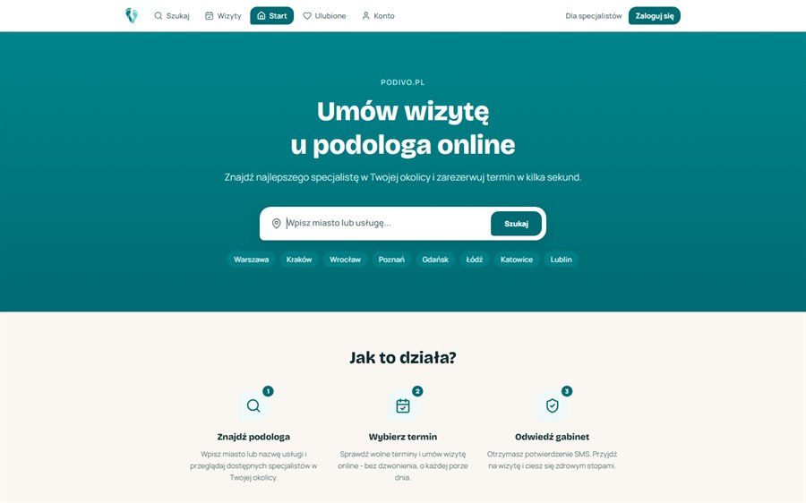
</a>

<table>
  <tr>
    <td width="50%">
      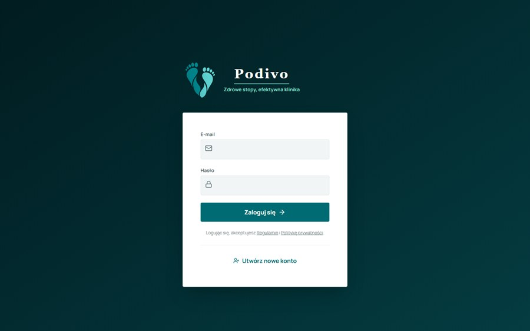
      
<b>PANEL KLINIKI</b> - logowanie dla gabinetów, z grafikiem i obsługą wizyt.

    </td>
    <td width="50%">
      
<b>W środku:</b>

      <ul>
        <li>rezerwacje online z potwierdzeniem SMS</li>
        <li>panel biznesowy dla klinik + sekcja pomocy</li>
        <li>własny serwer zdjęć gabinetów</li>
        <li>osobne bazy danych dla pacjentów, klinik i kartotek</li>
        <li>aplikacje na Androida</li>
      </ul>
      
<a href="https://podivo.pl"><b>-> podivo.pl</b></a>

    </td>
  </tr>
</table>

### BACKHAUL - A Trucking Company Sim

Symulacja firmy transportowej na mapie Polski i Europy: zlecenia, trasy, flota
i kierowcy z własnym morale, zmęczeniem i lojalnością. Budowana w Godot 4 na C#.
**W produkcji.**

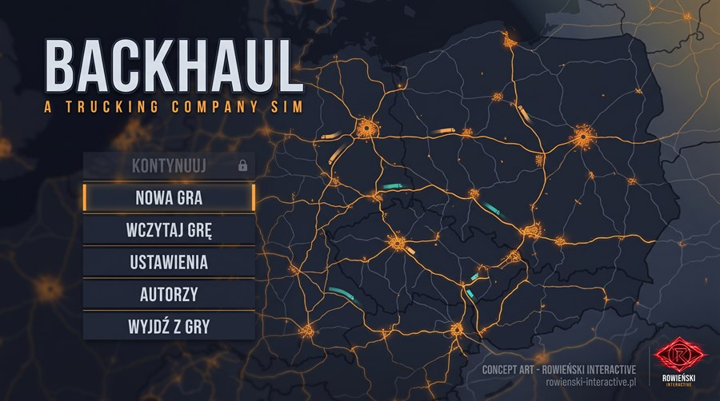

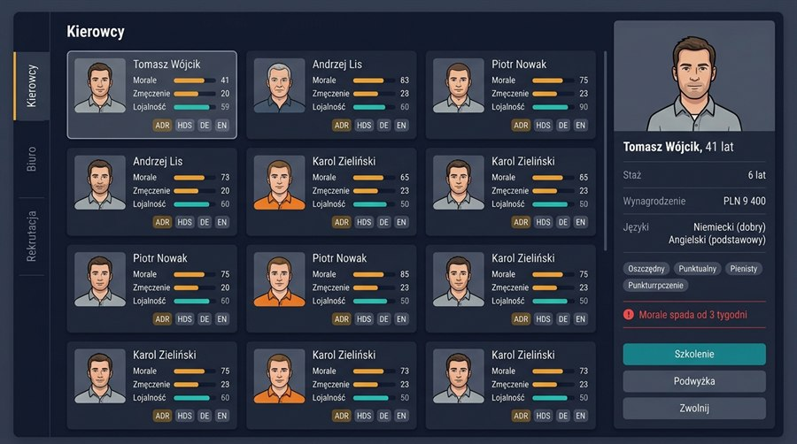

Menu główne i panel kierowców. Każdy kierowca ma staż, języki, wynagrodzenie i charakter,
a morale potrafi spadać tygodniami, jeśli się go nie pilnuje.

### POLSKI GAMING - portal gier i konfigurator PC

Newsy, recenzje i agregowane oceny gier plus konfigurator, który pokazuje wyłącznie
podzespoły pasujące do siebie. Bez zgadywania i bez list, które nic nie znaczą.

<a href="https://polskigaming.rowienski-interactive.pl">
  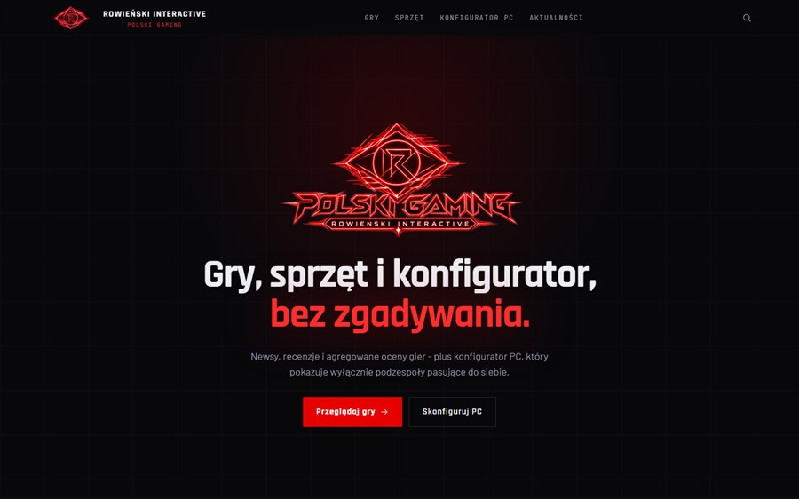
</a>

### ROWIEŃSKI INTERACTIVE - wizytówka warsztatu

Strona, z której wzięła się kolorystyka tego profilu. Pięć języków, zero szablonów,
100% kodu pisanego od zera.

<a href="https://rowienski-interactive.pl">
  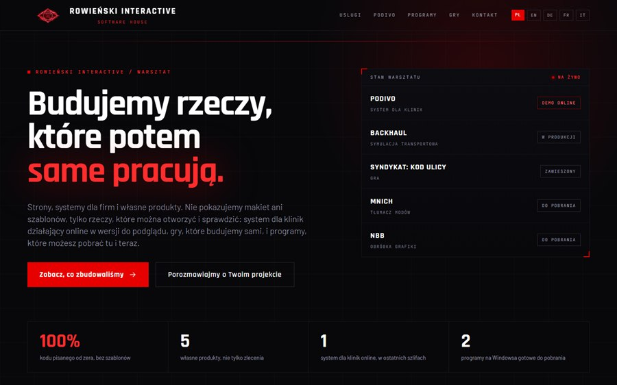
</a>




Nic z tego nie stoi na hostingu z półki. Mam trzy maszyny, które sam postawiłem
i sam utrzymuję: dwie w serwerowni i jedną u siebie.

**Serwer aplikacji** obsługuje to, co widzą ludzie - strony, panele klientów, zdjęcia
i pliki oraz firmową pocztę. **Serwer bazy danych** stoi osobno i trzyma dane wszystkich
systemów: konta, rezerwacje, kartoteki. Rozdzieliłem je celowo, bo ruch z internetu
nigdy nie powinien dotykać danych bezpośrednio - obie maszyny rozmawiają ze sobą wyłącznie
prywatnym, szyfrowanym połączeniem, którego z zewnątrz w ogóle nie widać.
**Serwer domowy** trzyma archiwum projektów i kopie zapasowe, a przy okazji obsługuje
dysk sieciowy i multimedia.


| | |
|---|---|
| **Systemy** | Linux (Debian) - ten sam, na którym stoi duża część internetu |
| **Rozdzielenie** | każda usługa w osobnym, odizolowanym kontenerze |
| **Połączenie** | prywatny, szyfrowany tunel między maszynami, niewidoczny z sieci |
| **Szyfrowanie** | certyfikaty HTTPS odnawiane automatycznie, bez ręcznej roboty |
| **Poczta** | własny serwer pocztowy z podpisem potwierdzającym nadawcę |
| **Ochrona** | zapora sieciowa, limity zapytań, pułapki na boty, filtr ruchu |
| **Nadzór** | monitoring całą dobę, z powiadomieniem, gdy coś odstaje od normy |
| **Kopie** | codzienne kopie zapasowe plus niezależne archiwum u mnie |

Wszystkie usługi na serwerze aplikacji mieszczą się razem w około **85 MB pamięci** -
bo narzędzia dobieram do serwera, a nie odwrotnie. Kiedy trzeba było uruchomić pocztę,
popularne gotowce odpadły przy kilku gigabajtach, więc poszło rozwiązanie, które
robi dokładnie to samo za ułamek tego.




  
  
  
  
  

  
  
  
  
  

  
  
  
  
  



Gotowe karty statystyk pokazałyby tu zero, bo wszystkie repozytoria są prywatne.
Ta liczy naprawdę - razem z commitami, których nie widać z zewnątrz.


  
  

 

  <b>Buduję rzeczy, które potem same pracują.</b> 
  Repozytoria produktów są prywatne - tutaj pokazuję, jak wyglądają od strony użytkownika.

